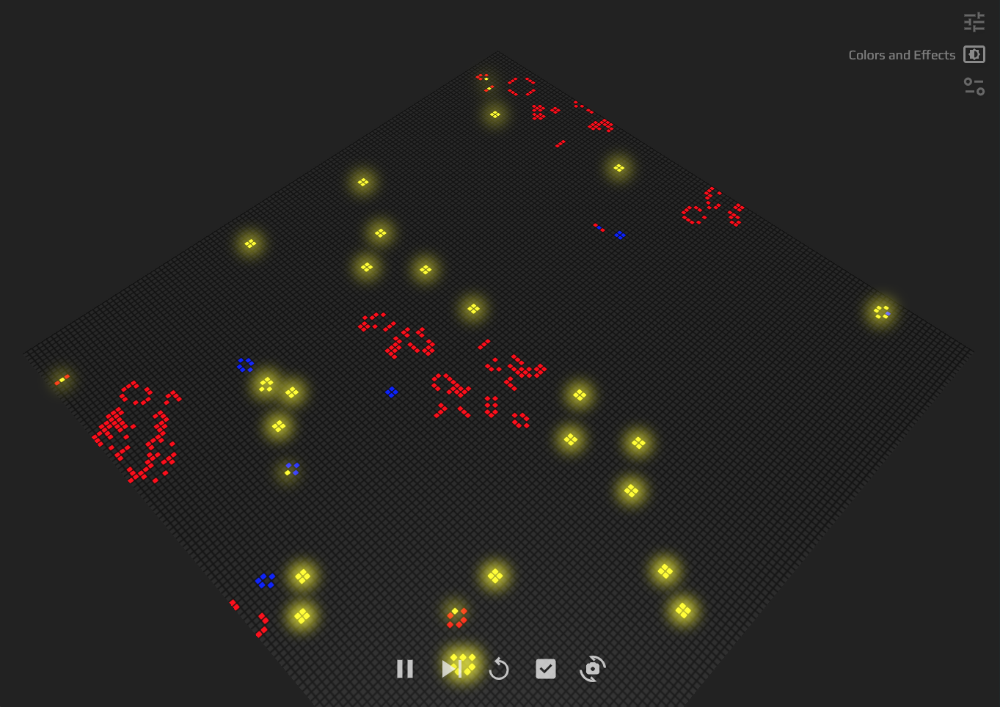

  <h1><code>game_of_life_next_gen</code></h1>

  <strong>Conway's Game of Life with Cutting-Edge Tech Stacks</strong>

  

  Originally built by <a href="https://rustwasm.github.io/">The Rust and WebAssembly Working Group</a>

  Original repository: <a href="https://github.com/rustwasm/wasm_game_of_life">rustwasm/wasm_game_of_life</a>

## About

This repository is an extended version of [rustwasm/wasm_game_of_life](https://github.com/rustwasm/wasm_game_of_life) repository.

## Features

- 🚀 Using WASM with Rust for processing the simulation
- 🌈 Each cell has the limited “age” and it is visible by colors
- 💻 Using WebGL for the beautiful animation
- ⚙️ Fully configurable game settings and visual configurations

## What are achieved in this repository?

- Expand `wasm_game_of_life` module to achieve new functionalities
- Refine UI/UX with many tech stacks (See more in [WWW/README](www/README.md))

## How to use

### Prerequisites

You need to install [wasm-pack](https://rustwasm.github.io/wasm-pack/) to build this module.

### Build module

- Run `wasm-pack build`
