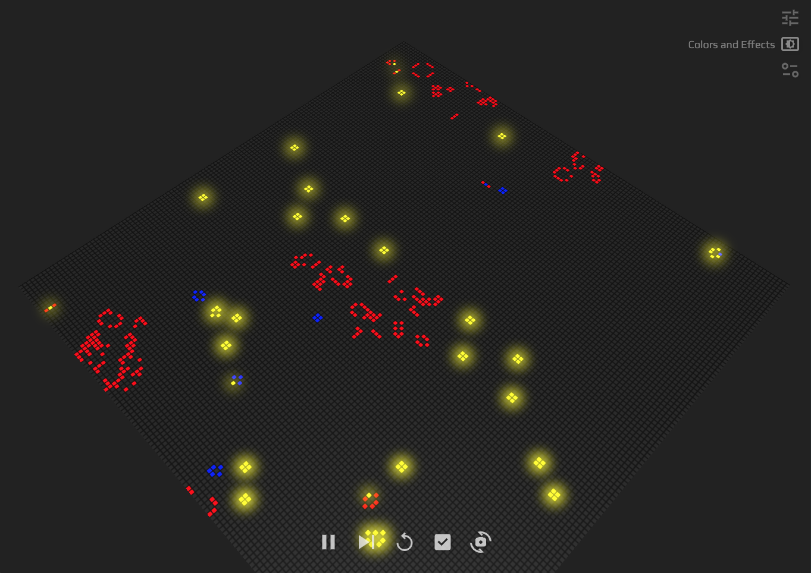

  <h1><code>game_of_life_next_gen/www</code></h1>

  <strong>Conway's Game of Life meets Web Technologies</strong>

  

## Features

### Design

- Designed UI from scratch. [Design file with Figma](https://www.figma.com/design/kJu2hyu2u9JXVERsx6cGCv/Game-of-Life-Next-Gen?node-id=0%3A1&t=Pd6HUq6KpkIBaw4Q-1)
- Dynamic screen color easily buries icons and letters. Carefully configured their colors efficiently using Storybook.

### Development

- Built faster development environment using pnpm/esbuild/vite.
- High test coverage with efficient writing with AI. [Test coverage](https://github.com/TakumaKira/game_of_life_next_gen/blob/master/www/coverage/coverage-report.txt)
- Testing and deployment automatically run on GitHub Actions.

## How to Use

### Prerequisites

You can use any other package manager like npm, yarn,...etc. But I chose pnpm for this project(That's why you can find `pnpm-lock.yaml` in the root directory).
If you are willing to follow, please [install pnpm](https://pnpm.io/installation) first.

### Run locally

1. Run `pnpm dev`
2. Open `http://localhost:8000` with your browser.

#### Additional configuration

`Alive Cell Base` options on `Game Rules` panel, which determines which cells are alive at start, can be `1 - 10` by default. You can change this to your preference like `1 - 20` by adding `.env` file in this directory with content `ALIVE_CELL_BASE_OPTIONS=20`.

### Run Storybook

1. Run `pnpm storybook`
2. Open `http://localhost:6006`(maybe automatically) with your browser.

### Run tests

1. Run `pnpm test`

### Appreciation

On top of the great developers contributed to any cool libraries I used for this project, I additionally want to say thank you for the author of `Play` font, [Jonas Hecksher](https://fonts.google.com/?preview.layout=grid&query=Jonas+Hecksher). This won't be finished without your work!
